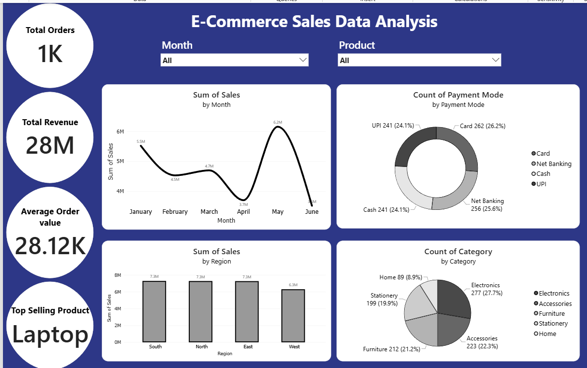

# instadot-internship-snehajaiswani-day3.
# 📊 E-Commerce Sales Data Analysis Dashboard

## 📌 Project Overview
This project presents an interactive **E-Commerce Sales Dashboard** built using **Power BI**. The dashboard provides a comprehensive view of sales performance across different months, regions, payment modes, and product categories. It also highlights key business metrics such as Total Orders, Total Revenue, Average Order Value, and Top Selling Product.

## 🛠️ Tools Used
- Power BI Desktop
- DAX (Data Analysis Expressions)
- Excel Dataset
- Data Visualization

## 📈 Dashboard KPIs
- **Total Orders:** 1,000
- **Total Revenue:** ₹28 Million
- **Average Order Value:** ₹28.12K
- **Top Selling Product:** Laptop

## 📊 Dashboard Features
- Monthly Sales Trend Analysis
- Regional Sales Comparison
- Payment Mode Distribution
- Product Category Distribution
- Interactive Slicers for Month and Product
- KPI Cards for Business Metrics

## 🔍 Key Insights & Recommendations

### 1. Regional Sales Performance
**Insight:** Sales are relatively consistent across all regions, with the **West region generating approximately ₹1 million less revenue** than the other regions.

**Recommendation:** Increase marketing efforts and introduce targeted promotional offers in the West region to improve sales performance.

---

### 2. Monthly Sales Trend
**Insight:** Sales reached their highest point in **May (₹6.2M)** but dropped significantly to **₹3.5M in June**.

**Recommendation:** Investigate the reasons behind the decline and launch seasonal campaigns or promotional activities to maintain sales momentum.

---

### 3. Payment Mode Analysis
**Insight:** Payment preferences are evenly distributed across Card, Net Banking, Cash, and UPI, with **Card payments contributing the highest share (26.2%)**.

**Recommendation:** Continue supporting all payment methods while encouraging digital transactions through cashback offers and reward programs.

---

### 4. Product Category Analysis
**Insight:** **Electronics** is the most popular category with **277 orders (27.7%)**, whereas **Home** products have the lowest demand with **89 orders (8.9%)**.

**Recommendation:** Maintain sufficient stock for Electronics products and promote Home products through discounts, bundles, or targeted marketing campaigns.

---

### 5. High Average Order Value
**Insight:** Despite fluctuations in monthly sales, the **Average Order Value remains high at ₹28.12K**, indicating that customers tend to make high-value purchases.

**Recommendation:** Focus on customer retention through loyalty programs, premium product bundles, and personalized offers to sustain high-value transactions.

## 🎯 Conclusion
The dashboard enables quick identification of sales trends, customer preferences, and business opportunities. These insights can support data-driven decisions to optimize marketing strategies, inventory planning, and overall sales performance.
